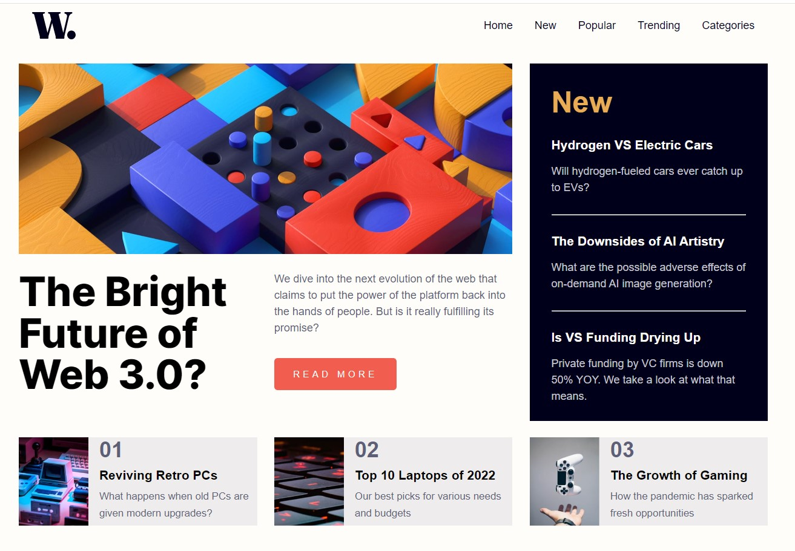

# Frontend Mentor - News homepage solution

This is a solution to the [News homepage challenge on Frontend Mentor](https://www.frontendmentor.io/challenges/news-homepage-H6SWTa1MFl). Frontend Mentor challenges help you improve your coding skills by building realistic projects. 

## Table of contents

- [Overview](#overview)
  - [The challenge](#the-challenge)
  - [Screenshot](#screenshot)
  - [Links](#links)
- [My process](#my-process)
  - [Built with](#built-with)
  - [What I learned](#what-i-learned)
  - [Continued development](#continued-development)
  - [Useful resources](#useful-resources)
- [Author](#author)
- [Acknowledgments](#acknowledgments)


## Overview

### The challenge

Users should be able to:

- View the optimal layout for the interface depending on their device's screen size
- See hover and focus states for all interactive elements on the page

### Screenshot (display screen 1366 x 810 px)




### Links


- Solution URL:  [Github repository](https://github.com/memominguez/news-homepage)
- Live Site URL:  [Github pages](https://memominguez.github.io/news-homepage/)


## My process

### Built with

- Semantic HTML5 markup
- CSS custom properties
- Flexbox
- CSS Grid


### What I learned

Another experience setting up CSS grids.

The upper portion of the page is set as "explicit grid"

For the lower portion of the page, used an "implicit grid" approach, with a few lines of code.

```css
 grid-template-columns: repeat(auto-fit, minmax(330px, 1fr));
```


### Continued development

Continue improving my coding skills by developing challenging applications, like this one.

### Useful resources

Miscellaneous video tutorials on CSS grid, as well as w3schools.com and developer.mozilla.org.

## Author


- Website - [Guillermo Dominguez](https://gdominguez-portfolio.netlify.app)
- Frontend Mentor - [@memominguez](https://www.frontendmentor.io/profile/memominguez)


## Acknowledgments


Thanks to all those who share their knowledge, free of charge, through video tutorials in the youtube platform.
 
